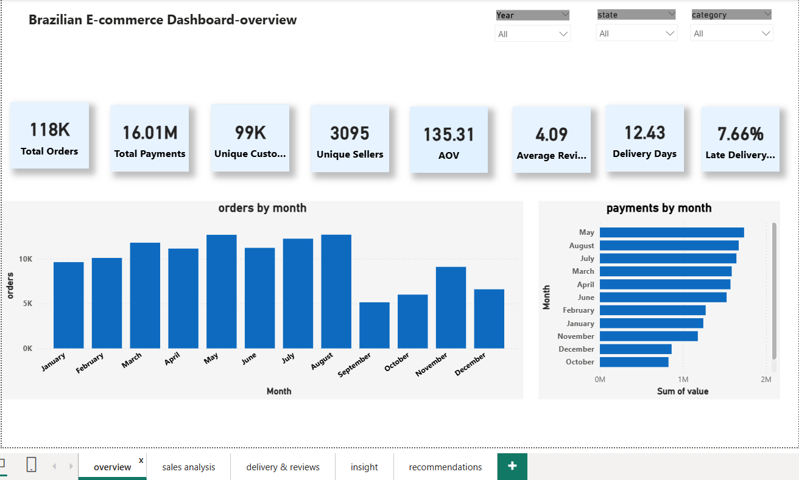
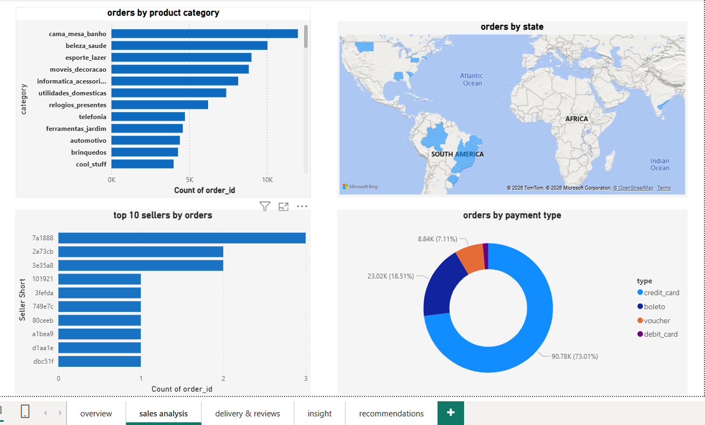
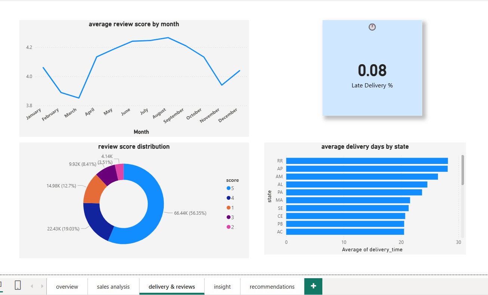
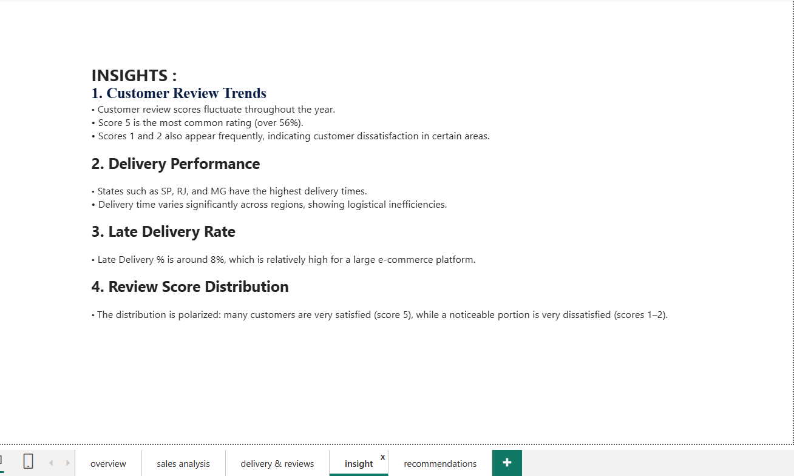
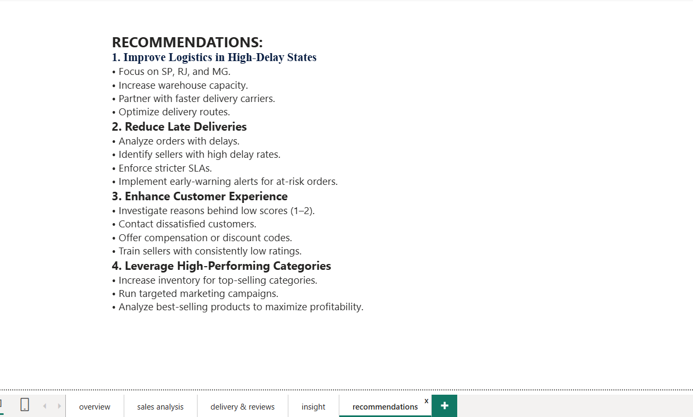

📊 Brazilian E‑Commerce Power BI Dashboard
A 5‑page interactive Power BI dashboard analyzing sales, customer behavior, delivery performance, and business insights using the Brazilian E‑Commerce Public Dataset.

📁 Project Overview
This project provides a complete analytical view of an e‑commerce platform in Brazil.
The dashboard helps stakeholders understand:

Sales performance

Customer satisfaction

Delivery efficiency

Top product categories

Key business bottlenecks

Actionable recommendations

📂 Dataset
Brazilian E‑Commerce Public Dataset  
Source: Kaggle

Includes:

Orders

Customers

Sellers

Products

Payments

Reviews

Geolocation

📌 Dashboard Pages
1️⃣ Overview
Total orders

Total revenue

Total customers

Total sellers

Monthly sales trend

Top product categories

2️⃣ Sales Analysis
Orders by category

Orders by state

Top 10 sellers

Payment type distribution

3️⃣ Delivery & Reviews
Average review score by month

Review score distribution

Average delivery days by state

Late delivery percentage

4️⃣ Insights
Key findings:

Review scores fluctuate during the year

Score 5 is the most common (≈56%)

Some states have significantly higher delivery times

Late delivery rate ≈ 8%

Review distribution is polarized (many 5s, many 1–2s)

5️⃣ Recommendations
Improve logistics in high‑delay states (SP, RJ, MG)

Reduce late deliveries using SLA monitoring

Improve customer experience for low‑score buyers

Increase inventory & marketing for top‑performing categories

 🖼 Screenshots  
Here are the dashboard pages uploaded in this repository:

-   
-   
-   
-   
- 

🛠 Tools & Technologies
Power BI Desktop

Power Query

DAX

Data Modeling

Git & GitHub

📥 Download PBIX  
You can download the full Power BI dashboard file here:  
[Brazilian E‑Commerce Dashboard.pbix](Brazilian%20E-Commerce%20Public%20Dataset%20by%20Olist.pbix)

📌 Conclusion
This dashboard provides a complete analytical view of the Brazilian e‑commerce ecosystem, helping businesses optimize logistics, improve customer satisfaction, and increase profitability.
